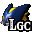

# OoTRMapTracker

## Content

This is a pack for [EmoTracker](https://emotracker.net/) designed for the [Ocarina of Time Randomizer](https://github.com/AmazingAmpharos/OoT-Randomizer).
You can easily download it from within the EmoTracker application.

This pack allows you to keep track of your current item loadout and has maps with all item locations for child and adult Link. These locations get filtered by your current item loadout to only show what you can actually reach.

## Questions

If you have any questions regarding the pack or the tracker itself, I recommend joining the [EmoTracker discord](https://emotracker.net/community/) and asking in there. Or you can just send me a DM on Discord to __Hamsda#4585__ or open an issue on Github.

## Variants

The pack offers 4 different variants:

1. Regular Map Tracker
2. Keysanity Map Tracker
3. Items Only
4. Items Only (Keysanity)
5. Items Only (minimal)

## Vanilla vs Master Quest Dungeons

The Randomizer has the option to switch some or all dungeons to their Master Quest equivalents.  
To accomodate for this, you can click on the dungeon labels to change them from vanilla  to Master Quest . You can use this in the non map variants as well as a reminder.  
This also means that the key counts for the dungeons in the Keysanity variants will always go up to the maximum of vanilla and Master Quest: Forest Temple goes up to 6 small keys, because MQ Forest Temple has 6 small keys instead of 5 in vanilla; Water Temple also goes up to 6 small keys, because vanilla Water Temple has 6 small keys unlike the 2 it has in MQ.

## Special items

There are a few special items whose purpose might not be directly obvious:

-  Checking this item reflects the carpenters being rescued from Gerudo Fortress. This is separate from the Gerudo Card  because of [various settings related to Gerudo Fortress in the randomizer](https://github.com/TestRunnerSRL/OoT-Randomizer/tree/Dev#gerudo-fortress).
-  Checking this item enables you to capture items placed at locations you received hints for by the Gossip Stones, even if you selected hints to be always on or require Mask of Truth instead of Stone of Agony.

## Settings (for map variants)

There is a variety of settings available to accomodate the different options that the Randomizer offers:

### Rainbow Bridge

This setting determines what is needed to trigger the rainbow bridge in front of Ganons castle.

-  All 6 medallions required
-  Light arrows, shadow medallion, and spirit medallion required
-  All 6 medallions and 3 stones required
-  Nothing required, bridge is always open

### Forest

This setting determines if you can leave the Kokiri Forest without beating the Deku Tree.

-  You will find the Kokiri Sword and Slingshot early on to beat the Deku Tree before leaving the Kokiri Forest.
-  You can immediately leave the Kokiri Forest.

### Kakariko Gate

This setting determines whether the Kakariko Gate starts open or closed as a child.

-  You will need to show Zeldas Letter to the guard in front of the gate to open it.
-  The Kakariko Gate starts open and you can go to Death Mountain Trail.

### Door of Time

This setting determines whether the Door of Time starts open or closed.

-  You will find the Song of Time as a child to open the Door of Time.
-  The Door of Time starts open and you can immediately go adult.

### Lens of Truth

This setting changes where the logic requires the Lens of Truth.

-  Required to see all invisible things.
-  Required to cross the Haunted Wasteland and to win the Treasure Chest minigame.
-  Required only to win the Treasure Chest minigame.

### Fewer Tunic Requirements

This setting changes where the [logic requires Goron and Zora tunics](https://github.com/TestRunnerSRL/OoT-Randomizer/tree/Dev#fewer-tunic-requirements).

-  Required basically everywhere a heat/breath timer shows up.
-  Required for fewer locations.

### Bombchus in logic

This setting determines if Bombchus are considered by the logic.

-  Bombchus will never be considered by the logic and can be used to sequence break bomb locations.
-  Bombchus can be used as regular explosives like bombs in logic.

### Shuffle Deku Scrubs

This setting determines if all Deku Scrubs have randomized items.

-  Only the three Deku Scrubs that give actual items in the vanilla game can have random items.
-  All Deku Scrubs can have random items.

### Shopsanity

This setting determines if Shopsanity is active.

-  The shops have their regular items.
-  A varying amount of items in the shops is randomized.

### Gold Skulltulas

This setting determines which Gold Skulltulas are shown (especially useful for Tokensanity).

-  Gold Skulltulas will be hidden.
-  The Gold Skulltulas in dungeons will be displayed.
-  All Gold Skulltulas will be displayed.

### Magic Beans

This setting determines how the Magic Beans will be handled on the map.

-  The bean patches won't show up on the child map and adult locations will just show up once you have the bean item.
-  The bean patches will show up on the child map and adult locations require those to be checked off (meaning the bean has actually been planted there).