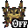
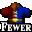

# OoTRMapTracker

## Content

This is a pack for [EmoTracker](https://emotracker.net/) designed for the [Ocarina of Time Randomizer](https://ootrandomizer.com/).
You can easily download it from within the EmoTracker application.

This pack allows you to keep track of your current item loadout and has maps with all item locations for child and adult Link. These locations get filtered by your current item loadout to only show what you can actually reach.

## Questions

If you have any questions regarding the pack or the tracker itself, I recommend joining the [EmoTracker discord](https://emotracker.net/community/) and asking in there. Or you can just send me a DM on Discord to __Hamsda#4585__ or open an issue on Github.

## Variants

The pack offers 5 different variants:

1. Regular Map Tracker
2. Keysanity Map Tracker
3. Items Only
4. Items Only (Keysanity)
5. Items Only (minimal)

## Vanilla vs Master Quest Dungeons

The Randomizer has the option to switch some or all dungeons to their Master Quest equivalents.  
To accomodate for this, you can click on the dungeon labels to change them from vanilla  to Master Quest . You can use this in the non map variants as a reminder.
The small key maximum amounts in the keysanity variants will dynamically update according to what you selected for the corresponding dungeon.

## Special items

Some of this functionality might not be immediately obvious:

- Right clicking / will overlay it with , indicating that you have confirmed the scarecrow song or started with free scarecrow. Locations that make use of the scarecrow will show up as sequence breaks unless this is turned on.
-  is used as a counter for ice traps. This is somewhat useful to evaluate freestanding items during racing, but mostly just for fun with settings that include higher numbers of ice traps.

## Settings (for map variants)

There is a variety of settings available to accomodate the different options that the Randomizer offers:

### Forest

This setting determines if you can leave the Kokiri Forest without beating the Deku Tree ([see wiki](https://github.com/TestRunnerSRL/OoT-Randomizer/wiki/setting-information#open-forest)).

-  You will find the Kokiri Sword and Slingshot early on to beat the Deku Tree before leaving the Kokiri Forest.
-  You can immediately leave the Kokiri Forest.

### Kakariko Gate

This setting determines whether the Kakariko Gate starts open or closed as a child ([see wiki](https://github.com/TestRunnerSRL/OoT-Randomizer/wiki/setting-information#open-kakariko-gate)).

-  You will need to show Zeldas Letter to the guard in front of the gate to open it.
-  The Kakariko Gate starts open and you can go to Death Mountain Trail.

### Door of Time

This setting determines whether the Door of Time starts open or closed ([see wiki](https://github.com/TestRunnerSRL/OoT-Randomizer/wiki/setting-information#open-door-of-time)).

-  You will find the Song of Time as a child to open the Door of Time.
-  The Door of Time starts open and you can immediately go adult.

### Zoras Fountain

This setting determines whether Zoras Fountain starts open or closed.

-  You can find Rutos Letter and open Zoras Fountain by moving King Zora.
-  Rutos Letter can no longer be found, but Zoras Fountain can be accessed without moving King Zora.

### Gerudo Fortress

This setting determines the state of the ([see wiki](https://github.com/TestRunnerSRL/OoT-Randomizer/wiki/setting-information#gerudo-fortress)).

-  You will have to rescue all 4 carpenters.
-  You only need to free one carpenter (F1 North).
-  The carpenters start free and the Fortress is immediately accessible (if `Shuffle Gerudo Card` is turned off, mark your  as well).

### Rainbow Bridge

This setting determines what is needed to trigger the rainbow bridge in front of Ganons castle ([see wiki](https://github.com/TestRunnerSRL/OoT-Randomizer/wiki/setting-information#rainbow-bridge-requirement)).

-  Nothing required, bridge is always open
-  Light arrows, shadow medallion, and spirit medallion required
-  All 3 stones required
-  All 6 medallions required
-  All 6 medallions and 3 stones required
-  100 gold skulltula tokens required

### Shuffle Kokiri Sword

This setting determines if the Kokiri Sword gets shuffled ([see wiki](https://github.com/TestRunnerSRL/OoT-Randomizer/wiki/setting-information#shuffle-kokiri-sword)).

-  The Kokiri Sword is not shuffled and will be captured in the corresponding chest by default.
-  The Kokiri Sword is shuffled into the item pool and will not be captured.

### Shuffle Ocarinas

This setting determines if the Ocarinas get shuffled ([see wiki](https://github.com/TestRunnerSRL/OoT-Randomizer/wiki/setting-information#shuffle-ocarinas)).

-  The Ocarinas are not shuffled and will be captured in the corresponding chests by default.
-  The Ocarinas are shuffled into the item pool and will not be captured.

### Shuffle Weird Egg

This setting determines if the Weird Egg gets shuffled ([see wiki](https://github.com/TestRunnerSRL/OoT-Randomizer/wiki/setting-information#shuffle-weird-egg)).

-  The Weird Egg is not shuffled and will be captured in the corresponding chest by default.
-  The Weird Egg is shuffled into the item pool and will not be captured.

### Shuffle Gerudo Card

This setting determines if the Gerudo Card gets shuffled ([see wiki](https://github.com/TestRunnerSRL/OoT-Randomizer/wiki/setting-information#shuffle-gerudo-card)).

-  The Gerudo Card is not shuffled and will be captured in the corresponding chest by default.
-  The Gerudo Card is shuffled into the item pool and will not be captured.

### Shuffle Deku Scrubs

This setting determines if all Deku Scrubs have randomized items ([see wiki](https://github.com/TestRunnerSRL/OoT-Randomizer/wiki/setting-information#shuffle-deku-salescrubs)).

-  Only the three Deku Scrubs that give actual items in the vanilla game can have random items.
-  All Deku Scrubs can have random items.

### Shopsanity

This setting determines if Shopsanity is active ([see wiki](https://github.com/TestRunnerSRL/OoT-Randomizer/wiki/setting-information#setting_shopsanity)).

-  The shops have their regular items.
-  A varying amount of items in the shops is randomized.

### Cowsanity

This setting determines if Cowsanity is active.

-  The cows just give milk when Eponas song gets played.
-  The cows will give a random item the first time Eponas song gets played.

### Gold Skulltulas

This setting determines which Gold Skulltulas are shown (especially useful for [Tokensanity](https://github.com/TestRunnerSRL/OoT-Randomizer/wiki/setting-information#tokensanity)).

-  Gold Skulltulas will be hidden.
-  The Gold Skulltulas in dungeons will be displayed.
-  All Gold Skulltulas will be displayed.

### Bombchus in logic

This setting determines if Bombchus are considered by the logic ([see wiki](https://github.com/TestRunnerSRL/OoT-Randomizer/wiki/setting-information#bombchus-are-considered-in-logic)).

-  Bombchus will never be considered by the logic and can be used to sequence break bomb locations.
-  Bombchus can be used as regular explosives like bombs in logic.

### Lens of Truth

This setting changes where the logic requires the Lens of Truth ([see wiki](https://github.com/TestRunnerSRL/OoT-Randomizer/wiki/setting-information#lens-of-truth)).

-  Required to see all invisible things.
-  Required to cross the Haunted Wasteland and to win the Treasure Chest minigame.
-  Required only to win the Treasure Chest minigame.

### Fewer Tunic Requirements

This setting changes where the logic requires Goron and Zora tunics ([see wiki](https://github.com/TestRunnerSRL/OoT-Randomizer/wiki/setting-information#fewer-tunic-requirements)).

-  Required basically everywhere a heat/breath timer shows up.
-  Required for fewer locations.

### Hints

This setting determines when hintable locations will show up on the map ([see wiki](https://github.com/TestRunnerSRL/OoT-Randomizer/wiki/setting-information#gossip-stones)).

-  Hintable locations will never show up on the map.
-  Hintable locations will show up on the map if you have .
-  Hintable locations will show up on the map if you have .
-  Hintable locations will always show up on the map.

### Magic Beans

This setting determines how the Magic Beans will be handled on the map.

-  The bean patches won't show up on the child map and adult locations will just show up once you have the bean item.
-  The bean patches will show up on the child map and adult locations require those to be checked off (meaning the bean has actually been planted there).