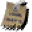

# OoTRMapTracker

## Content

This is a pack for [EmoTracker](https://emotracker.net/) designed for the [Ocarina of Time Randomizer](https://ootrandomizer.com/).
You can easily download it from within the EmoTracker application.

This pack allows you to keep track of your current item loadout and has maps with all item locations for child and adult Link. These locations get filtered by your current item loadout to only show what you can actually reach.

## Questions

If you have any questions regarding the pack or the tracker itself, I recommend joining the [EmoTracker discord](https://emotracker.net/community/) and asking in there. Or you can just send me a DM on Discord to __Hamsda#4585__ or open an issue on Github.

## Variants

The pack offers 7 different variants:

1. Map Tracker
2. Map Tracker (Keysanity)
3. Items Only
4. Items Only (Keysanity)
5. Items Only (minimal)
6. Entrance Randomizer
7. Entrance Randomizer (Keysanity)

## Vanilla vs Master Quest Dungeons

The randomizer has the option to switch some or all dungeons to their Master Quest equivalents.
To accomodate for this, you can click on the dungeon labels to change their current status:

-  The dungeons vanilla checks will be shown.
-  The dungeons MQ checks will be shown.
-  Both versions of the dungeon will be shown.

You can use this in the non map variants as a reminder.

The small key maximum amounts in the keysanity variants will dynamically update according to what you selected for the corresponding dungeon.
If you have a dungeon marked as unknown in non-keysanity, some of the checks in the dungeon might not show up correctly until you pick either vanilla or MQ.

## Special items

Some of this functionality might not be immediately obvious:

- Right clicking / will overlay it with  indicating that you have confirmed the scarecrow song or started with free scarecrow. Locations that make use of the scarecrow will not show up unless this is turned on. The location of the scarecrow in Lake Hylia will automatically mark this when cleared first as child and then as adult.
-  is used as a counter for Triforce pieces in the Triforce Hunt mode.

## Settings (for map variants)

There is a variety of toggles available to accomodate the different settings the randomizer offers. The settings are arranged to mimic the current GUI of the randomizer. The default for all of these should match the settings used for the weekly races (check out the OoTR discord for more info).

### Main Rules

This tab contains most of the important settings that can have a major impact on the logic of a randomizer seed ([see wiki](https://wiki.ootrandomizer.com/index.php?title=Readme#Main_Rules)).

#### Forest

This setting determines if you can leave the Kokiri Forest without beating the Deku Tree.

-  You will find the Kokiri Sword and Slingshot early on to beat the Deku Tree before leaving Kokiri Forest.
-  You can leave Kokiri Forest but will need the Kokiri Sword and Deku Shield to go to the Deku Tree.
-  You can immediately leave Kokiri Forest and go to the Deku Tree.

#### Door of Time

This setting determines whether the Door of Time starts open or closed.

-  You will need to find Song of Time to open the Door of Time and unlock the ability to time travel.
-  The Door of Time starts open and you can immediately switch between ages.

#### Zora's Fountain

This setting determines whether Zoras Fountain starts open or closed.

-  You can find Rutos Letter and open Zoras Fountain by moving King Zora.
-  Zoras Fountain can be accessed as adult without handing in Rutos Letter. Child access to the fountain is unchanged.
-  Rutos Letter can no longer be found, but Zoras Fountain can be accessed without moving King Zora for both ages.

#### Gerudo Fortress

This setting determines the state of the.

-  You will have to rescue all 4 carpenters.
-  You only need to free one carpenter (F1 North).
-  The carpenters start free and the Fortress is immediately accessible (if `Shuffle Gerudo Card` is turned off, mark your  as well).

#### Rainbow Bridge Requirement

This setting determines what is needed to trigger the rainbow bridge in front of Ganons castle.

-  Nothing required, bridge is always open
-  Light arrows, shadow medallion, and spirit medallion required
-  All 3 stones required
-  All 6 medallions required
-  All 6 medallions and 3 stones required
-  Gold skulltula tokens required (always assumes all 100 are required)

#### Number of Trials

This setting determines how many trials are needed to dispel the barrier in Ganons castle.

 Increment or decrement the number of trials needed.

If trials are set to at least 1, Ganons castle will show locations for the trials. When you clear a trial, mark that location as cleared. Once the number of cleared trials is greater than the number of required trials, the last chest will appear available.

I have not found a good way to represent that a trial started as dispelled.

#### Starting Age

This setting determines which age you started as. Most relevant in combination with Closed Door of Time.

-  Link started as child.
-  Link started as adult.

Getting  from Temple of Time unlocks checks for the other age.

#### Bombchus Are Considered in Logic

This setting determines if Bombchus are considered by the logic.

-  Bombchus will never be considered by the logic and can be used to sequence break bomb locations.
-  Bombchus can be used as regular explosives like bombs in logic.

#### Shopsanity

This setting determines if Shopsanity is active.

-  The shops have their regular items.
-  A varying amount of items in the shops is randomized.

#### Tokensanity

This setting determines which Gold Skulltulas are shown, especially useful for Tokensanity.

-  Gold Skulltulas will be hidden.
-  Gold Skulltulas in dungeons will be displayed.
-  Gold Skulltulas in the overworld will be displayed.
-  All Gold Skulltulas will be displayed.

#### Scrub Shuffle

This setting determines if all Deku Scrubs have randomized items.

-  Only the three Deku Scrubs that give actual items in the vanilla game can have random items.
-  All Deku Scrubs can have random items.

#### Shuffle Cows

This setting determines if cows have randomized items.

-  The cows just give milk when Eponas song gets played.
-  The cows will give a random item the first time Eponas song gets played.

#### Shuffle Kokiri Sword

This setting determines if the Kokiri Sword gets shuffled.

-  The Kokiri Sword is not shuffled and will be captured in the corresponding chest by default.
-  The Kokiri Sword is shuffled into the item pool and will not be captured.

#### Shuffle Ocarinas

This setting determines if the Ocarinas get shuffled.

-  The Ocarinas are not shuffled and will be captured in the corresponding chests by default.
-  The Ocarinas are shuffled into the item pool and will not be captured.

#### Shuffle Weird Egg

This setting determines if the Weird Egg gets shuffled.

-  The Weird Egg is not shuffled and will be captured in the corresponding chest by default.
-  The Weird Egg is shuffled into the item pool and will not be captured.

#### Shuffle Gerudo Card

This setting determines if the Gerudo Card gets shuffled.

-  The Gerudo Card is not shuffled and will be captured in the corresponding chest by default.
-  The Gerudo Card is shuffled into the item pool and will not be captured.

#### Shuffle Magic Beans

This setting determines if Magic Beans are shuffled.

-  Magic Beans are not shuffled and will be captured in the corresponding chest by default.
-  The Magic Beans are shuffled into the item pool and will not be captured.

#### Hints

This setting determines when hintable locations will show up on the map ([see wiki](https://wiki.ootrandomizer.com/index.php?title=Readme#Other)).

-  Hintable locations will never show up on the map.
-  Hintable locations will show up on the map if you have .
-  Hintable locations will show up on the map if you have .
-  Hintable locations will always show up on the map.

#### Damage Multiplier

This setting determines how much damage you take ([see wiki](https://wiki.ootrandomizer.com/index.php?title=Readme#Other)).

-  Damage is halved.
-  Damage is normal.
-  Damage is doubled.
-  Damage is quadrupled.
-  Damage kills you in one hit.

#### Bean Planting

This setting determines how the Magic Beans will be handled on the map.

-  The bean patches won't show up on the child map and adult locations will just show up once you have the bean item.
-  The bean patches will show up on the child map and adult locations require those to be checked off (meaning the bean has actually been planted there).

### Detailed Logic

This tab includes some options for more granular logic changes ([see wiki](https://wiki.ootrandomizer.com/index.php?title=Readme#Detailed_Logic)).

#### Nighttime Skulltulas Expect Sun's Song

This setting determines if logic expects the player to have an ocarina and the Sun’s Song to get Gold Skulltula locations that are only found at nighttime.

-  Sun's Song is not expected by logic.
-  Sun's Song is expected, but locations will show as sequence breaks.

#### Lens of Truth

This setting changes where the logic requires the Lens of Truth.

-  Required to see all invisible things.
-  Required to cross the Haunted Wasteland and to win the Treasure Chest minigame.
-  Required only to win the Treasure Chest minigame.

#### Logic Tricks

This tab also contains a list of (some of) the logic tricks that can be enabled in the randomizer.

## Entrance Randomizer variants

The entrance randomizer variants are very different from the regular map tracker variants. The map does not include any item locations to be checked, because that would result in way too many spots on the map, but instead has locations for the randomized entrances. They are split between `Entrances` (grottos, houses, dungeons, etc) and `Connectors` (connections between different overworld areas).

All locations have a capture spot, where you can mark what is at that location. If the location is useless, just mark off the icon to clean up the map. Later you can see what led where by simply hovering over the locations.

There are two variants, one for keysanity and one without, but none of the items are actually used for "logic" (to show/hide some entrances).

Additionally there are counters for the useful indoors entrances, so you can evaluate how much focus to put on exploring more entrances:

-  9 generic grottos (1 chest, 1 gossip stone).
-  10 grottos that contain 2 or 3 scrubs each. Only 2 of these are relevant if `Shuffle Scrubs` is off.
-  4 grottos/houses that only have a cow (Impas House Back, Ingo Barn, Lon Lon Corner Tower, Mountain Bombable Grotto). The other cow spots have their own markers ( and )
-  6 Great Fairy Fountains.
-  8 randomized shops (Kakariko Potion Shop has 2 separate entrances, only counted once).

I made a [quick explanation](https://www.twitch.tv/videos/429980574) on how to use the ER variant (slightly outdated but the general principle still is the same).
