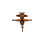
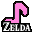
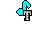
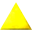
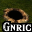
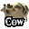
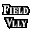
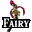
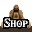

# Ocarina of Time Randomizer Map Tracker

This pack is designed for the [Ocarina of Time Randomizer](https://ootrandomizer.com/).

## Variants

The pack offers 7 different variants:

1. Map Tracker
2. Map Tracker (Keysanity)
3. Items Only
4. Items Only (Keysanity)
5. Items Only (minimal)
6. Entrance Randomizer
7. Entrance Randomizer (Keysanity)

## Vanilla vs Master Quest Dungeons

The randomizer has the option to switch some or all dungeons to their Master Quest equivalents.
To accomodate for this, you can click on the dungeon labels to change their current status:

-  The dungeons vanilla checks will be shown.
-  The dungeons MQ checks will be shown.
-  Both versions of the dungeon will be shown.

You can use this in the non map variants as a reminder.

The small key maximum amounts in the keysanity variants will dynamically update according to what you selected for the corresponding dungeon.
If you have a dungeon marked as unknown in non-keysanity, some of the checks in the dungeon might not show up correctly until you pick either vanilla or MQ.

## Special items

Some of this functionality might not be immediately obvious:

- Right clicking / will overlay it with  indicating that you have confirmed the scarecrow song or started with free scarecrow. Locations that make use of the scarecrow will not show up unless this is turned on. The location of the scarecrow in Lake Hylia will automatically mark this when cleared first as child and then as adult.
- Right clicking any of the song icons, e.g. , will overlay them with a smaller version, e.g. , that can be cycled through. This overlay has no logical bearing, but can be used to indicate which song has been found where in non songsanity.
-  is used as a counter for Triforce pieces in the Triforce Hunt mode.

## Entrance Randomizer variants

The entrance randomizer variants are very different from the regular map tracker variants:

- `Locations`: checks in the overworld and checks from non randomized `Exits`
- `Exits`: randomized grottos, houses, dungeons, and overworld connections

All locations on the `Exits` map have a capture spot, where you can mark what is at that location. Later you can see what led where by simply hovering over the locations with your mouse. If the location is useless, just mark off the icon to clean up the map. Some important locations should not be cleared, because they might be relevant to logic as pathways:

- Links House
- Temple of Time
- Dampes Grave
- Windmill
- Potion Shop Front/Back
- Spirit Temple

There are two variants, one for keysanity and one without. The keysanity variant uses the keys you mark for logic, while the other variant just assumes you have all keys at all times.

I made a [quick explanation](https://youtu.be/4l8gDPkovAc) on how to use the ER variant, based on the previous split, but it still works basically the same. Excuse the poor sound quality, I don't have a great microphone.

### Counters

There are counters for the useful indoors entrances, so you can evaluate how much focus to put on exploring more entrances:

-  9 generic grottos (1 chest, 1 gossip stone).
-  10 grottos that contain 2 or 3 scrubs each. Only 2 of these are relevant if `Shuffle Scrubs` is off.
-  4 grottos/houses that only have a cow (Impas House Back, Ingo Barn, Lon Lon Corner Tower, Mountain Bombable Grotto). The other cow spots have their own markers ( and )
-  6 Great Fairy Fountains.
-  7 randomized shops (Kakariko Potion Shop has 2 separate icons for capture).

## Settings

The cogwheel at the top of the items allows you to change several settings for the tracker. An explanation of each can be found [here](SETTINGS.md).
