# Settings (for map variants)

There is a variety of toggles available to accomodate the different settings the randomizer offers. The settings are arranged to mimic the current GUI of the randomizer.

The presets icon is a customizable preset loader. Cycle through the presets with left click and load with right click (some settings might require an extra right click since they depend on other settings).
To customize the presets, please override `scripts/user_presets.lua` and edit to your liking. I hope the structure is fairly straightforward. Which setting number corresponds to which setting can be found in `items/options.json` (0 based indexing).

## Main Rules: Open

This tab contains most of the important settings that determine how "open" a randomizer seed is ([see wiki](https://wiki.ootrandomizer.com/index.php?title=Readme#Open)).

### Forest

This setting determines if you can leave the Kokiri Forest without beating the Deku Tree.

- 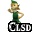 You will find the Kokiri Sword and Slingshot early on to beat the Deku Tree before leaving Kokiri Forest.
-  You can leave Kokiri Forest but will need the Kokiri Sword and Deku Shield to go to the Deku Tree.
-  You can immediately leave Kokiri Forest and go to the Deku Tree.

### Kakariko Gate

This setting determines the behaviour of the Kakariko Gate to Death Mountain Trail as child as well as the Happy Mask Shop.

-  The gate is always open. The Happy Mask Shop opens once you obtain Zelda's Letter.
-  Both the gate and the Happy Mask Shop open once you obtain Zelda's Letter.
- 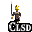 Both the gate and the Happy Mask Shop are closed until showing Zelda's Letter to the guard.

### Door of Time

This setting determines whether the Door of Time starts open or closed.

- 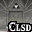 You will need to find Song of Time to open the Door of Time and unlock the ability to time travel.
- 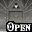 The Door of Time starts open and you can immediately switch between ages.

### Zora's Fountain

This setting determines whether Zoras Fountain starts open or closed.

-  You can find Rutos Letter and open Zoras Fountain by moving King Zora.
-  Zoras Fountain can be accessed as adult without handing in Rutos Letter. Child access to the fountain is unchanged.
-  Rutos Letter can no longer be found, but Zoras Fountain can be accessed without moving King Zora for both ages.

### Gerudo Fortress

This setting determines the state of the.

-  You will have to rescue all 4 carpenters.
-  You only need to free one carpenter (F1 North).
-  The carpenters start free and the Fortress is immediately accessible.

### Rainbow Bridge Requirement

This setting determines what is needed to trigger the rainbow bridge in front of Ganons castle.

-  Nothing required, bridge is always open
-  Light arrows, shadow medallion, and spirit medallion required
-  Variable amount of stones required
-  Variable amount of medallions required
-  Variable amount of medallions and stones required
-  Variable amount of Gold Skulltula tokens required

### Rainbow Bridge Amount

This setting determines how many (if any) of the items specified in `Rainbow Bridge Requirement` are needed.

 Increment or decrement the number required.

### Number of Trials

This setting determines how many trials are needed to dispel the barrier in Ganons castle.

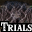 Increment or decrement the number of trials needed.

If trials are set to at least 1, Ganons castle will show locations for the trials. When you clear a trial, mark that location as cleared. Once the number of cleared trials is greater than the number of required trials, the last chest will appear available.

I have not found a good way to represent that a trial started as dispelled.

## Main Rules: World

This tab contains more settings about the world structure of a randomizer seed ([see wiki](https://wiki.ootrandomizer.com/index.php?title=Readme#World)).

A lot of these settings will not have any influence on the standard variant. To get the full benefits, you will need to use the entrance randomizer variant.

### Starting Age

This setting determines which age you started as.

- 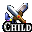 Link started as child.
-  Link started as adult.

If you have selected  or collected an  and  the checks for the other age will unlock.

### Shuffle Interior Entrances

- 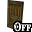 No interiors are shuffled.
- 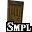 Interiors except Link's House, Temple of Time, Kak Potion Shop, and Windmill are shuffled.
- 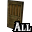 All interiors are shuffled.

### Shuffle Grotto Entrances

-  Grottos and graves are not shuffled.
- 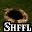 Grottos and graves are shuffled.

### Shuffle Dungeon Entrances

- 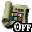 Dungeons are not shuffled.
-  Dungeons are shuffled.

### Shuffle Overworld Entrances

- 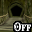 Overworld entrances are not shuffled.
- 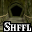 Overworld entrances are shuffled.

### Mix Entrance Pools

-  Entrance pools are not mixed.
-  Shuffled entrances that are not `Overworld` are mixed.
-  All shuffled entrances are mixed.

### Randomize Owl Drops

- 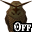 Owl drops are not shuffled.
-  Owl drops are shuffled.

### Randomize Warp Song Destinations

-  Warp song destinations are not shuffled.
-  Warp song destinations are shuffled.

### Randomize Overworld Spawns

-  Spawns are not shuffled.
- 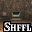 Spawns are shuffled.

### Bombchus Are Considered in Logic

This setting determines if Bombchus are considered by the logic.

- 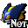 Bombchus will never be considered by the logic and can be used to sequence break bomb locations.
-  Bombchus can be used as regular explosives like bombs in logic.

## Main Rules: Shuffle

This tab contains settings about additional items being shuffled ([see wiki](https://wiki.ootrandomizer.com/index.php?title=Readme#Shuffle)).

### Shopsanity

This setting determines if Shopsanity is active.

-  The shops have their regular items.
-  A varying amount of items in the shops is randomized.

### Tokensanity

This setting determines which Gold Skulltulas are shown, especially useful for Tokensanity.

-  Gold Skulltulas will be hidden.
-  Gold Skulltulas in dungeons will be displayed.
-  Gold Skulltulas in the overworld will be displayed.
-  All Gold Skulltulas will be displayed.

### Scrub Shuffle

This setting determines if all Deku Scrubs have randomized items.

- 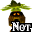 Only the three Deku Scrubs that give actual items in the vanilla game can have random items.
-  All Deku Scrubs can have random items.

### Shuffle Cows

This setting determines if cows have randomized items.

-  The cows just give milk when Eponas song gets played.
- 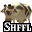 The cows will give a random item the first time Eponas song gets played.

### Shuffle Kokiri Sword

This setting determines if the Kokiri Sword gets shuffled.

- 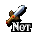 The Kokiri Sword is not shuffled and will be captured in the corresponding chest by default.
- 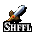 The Kokiri Sword is shuffled into the item pool and will not be captured.

### Shuffle Ocarinas

This setting determines if the Ocarinas get shuffled.

-  The Ocarinas are not shuffled and will be captured in the corresponding chests by default.
-  The Ocarinas are shuffled into the item pool and will not be captured.

### Shuffle Weird Egg

This setting determines if the Weird Egg gets shuffled.

- 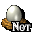 The Weird Egg is not shuffled and will be captured in the corresponding chest by default.
-  The Weird Egg is shuffled into the item pool and will not be captured.

### Shuffle Gerudo Card

This setting determines if the Gerudo Card gets shuffled.

- 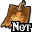 The Gerudo Card is not shuffled and will be captured in the corresponding chest by default.
-  The Gerudo Card is shuffled into the item pool and will not be captured.

### Shuffle Magic Beans

This setting determines if Magic Beans are shuffled.

-  Magic Beans are not shuffled and will be captured in the corresponding chest by default.
-  The Magic Beans are shuffled into the item pool and will not be captured.

### Shuffle Medigoron & Carpet Salesman

This setting determines if Medigoron and Carpet Salesman items are shuffled.

-  Medigoron and Carpet Salesman items are not shuffled.
-  Medigoron and Carpet Salesman items are shuffled and the merchants sell one randomized item for 200 rupees each.

## Main Rules: Shuffle Dungeon Items

This tab contains settings about dungeon items being shuffled ([see wiki](https://wiki.ootrandomizer.com/index.php?title=Readme#Shuffle_Dungeon_Items)).

In non keysanity variants, all of these settings will be forced to `Off`, effectively giving you every key. Can be used with the keysanity variants in mystery settings, so you don't have to mark all keys manually.

The individual keycounts will be remembered, should you turn this on by accident. Just turn it off again to restore your previous keycounts.

### Shuffle Small Keys

This setting determines if Small Keys are shuffled (non keys variants will force this off).

- 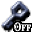 Small Keys are not shuffled and will always be considered at their maximum.
-  Small Keys are shuffled and need to be tracked by the user.

### Shuffle Thieves' Hideout Keys

This setting determines if Thieves' Hideout Keys are shuffled (non keys variants will force this off).

- 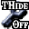 Thieves' Hideout Keys are not shuffled and will always be considered at their maximum.
- 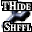 Thieves' Hideout Keys are shuffled and need to be tracked by the user.

### Shuffle Boss Keys

This setting determines if Boss Keys are shuffled (non keys variants will force this off).

- 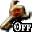 Boss Keys are not shuffled and will always be considered active.
- 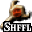 Boss Keys are shuffled and need to be tracked by the user.

### Shuffle Ganon's Boss Key

This setting determines if Ganon's Boss Key is shuffled (non keys variants will force this off).

- 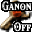 Ganon's Boss Key is not shuffled and will always be considered active.
- 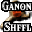 Ganon's Boss Key is shuffled and needs to be tracked by the user.

## Other

This tab contains some additional settings mostly for convenience ([see wiki](https://wiki.ootrandomizer.com/index.php?title=Readme#Other_2)).

### Skip Child Zelda

This setting determines if visiting Zelda in the Hyrule Castle Gardens is skipped.

- 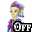 Zelda has to be visited like in the vanilla game.
- 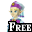 Zelda already counts as visited, allowing dependent events to unfold.

### Complete Mask Quest

This setting determines if all masks will be available once the Happy Mask Shop is open.

- 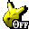 The mask quest has to be completed step by step like in the vanilla game.
-  All the masks will be available once the Happy Mask Shop is open.

### Hints

This setting determines when hintable locations will show up on the map ([see wiki](https://wiki.ootrandomizer.com/index.php?title=Readme#Other)).

- 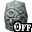 Hintable locations will never show up on the map.
-  Hintable locations will show up on the map if you have .
- 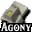 Hintable locations will show up on the map if you have 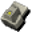.
-  Hintable locations will always show up on the map.

### Damage Multiplier

This setting determines how much damage you take ([see wiki](https://wiki.ootrandomizer.com/index.php?title=Readme#Other)).

-  Damage is halved.
-  Damage is normal.
-  Damage is doubled.
-  Damage is quadrupled.
-  Damage kills you in one hit.

### Nighttime Skulltulas Expect Sun's Song

This setting determines if logic expects the player to have an ocarina and the Sun’s Song to get Gold Skulltula locations that are only found at nighttime.

- 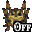 Sun's Song is not expected by logic.
-  Sun's Song is expected, but locations will show as sequence breaks.

## Logic Tricks

This tab contains a list of the logic tricks that can be enabled in the randomizer ([see wiki](https://wiki.ootrandomizer.com/index.php?title=Readme#Detailed_Logic)).

The tracker will show the tricks from this list as sequence breaks, even if they are turned off. Enabling them will show them as in logic instead, reflecting your chosen logic as closely as possible.
